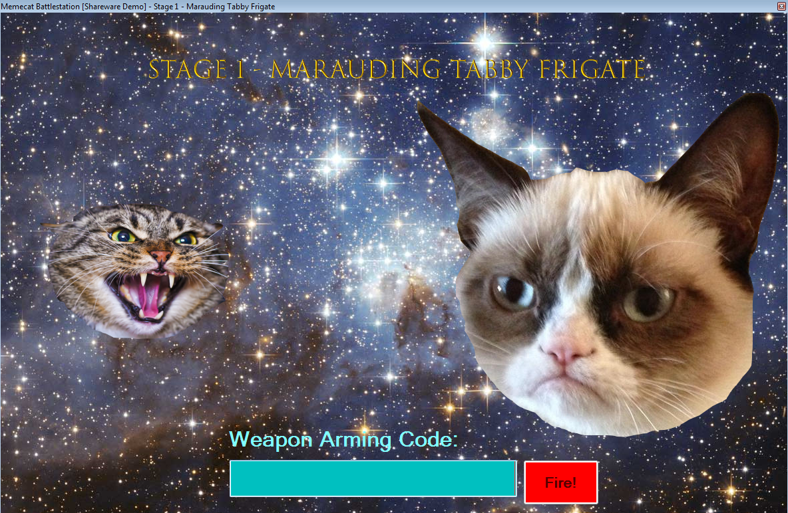
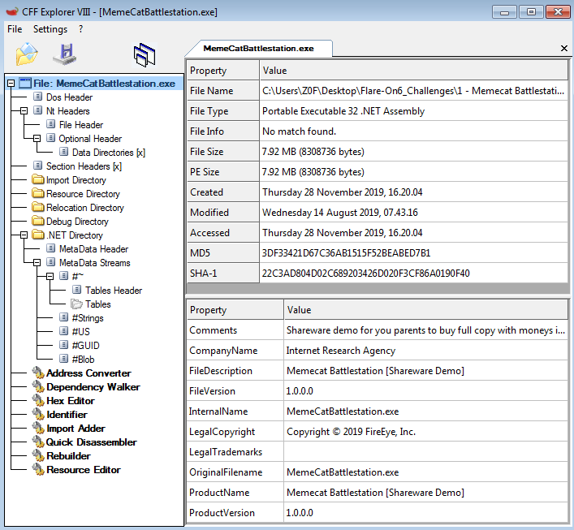
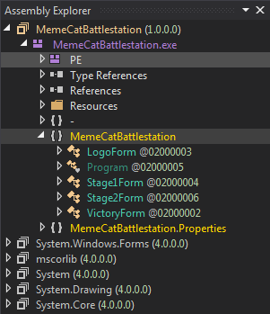
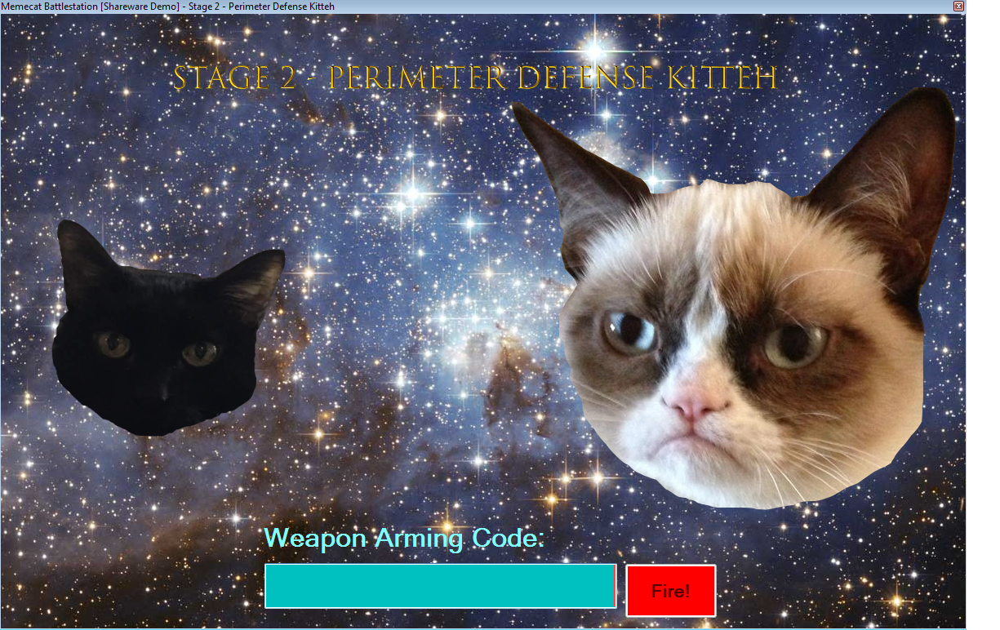
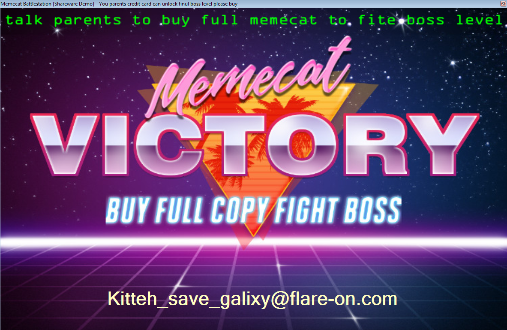

# Flare-On 1: Memecat Battlestation

This challenge is part of the Fare-On challenges hosted by FireEye. This challenge was made by Nick Harbour (@nickaharbour). You can find more information here: https://www.fireeye.com/blog/threat-research/2019/09/2019-flare-on-challenge-solutions.html

# Initial Analysis

This is what we see when the program launches:

<p>
  
</p>

The program wants us to input what it calls "weapon codes". If the code is correct we move on to the next stage and eventually win.

To get started it's a good idea to identify the target. According to CFF Explorer this is a x32 .NET program.

<p>
  
</p>

Because it's .NET it can easily be decompiled, assuming there is no obfuscation. A great tool for reversing .NET is dnSpy, but ILSpy or any other tool works too.

<p>
  
</p>

# Stage 1

There are three main forms: `Stage1Form`, `Stage2Form`, and `VictoryForm`. Because this is a CTF with multiple stages, let's start at `Stage1Form`. Inside of the constructor for this form there is a call to `InitializeComponent();`. Viewing this function reveals that it's an initialization function for all of the form components such as buttons, input fields, and text/labels. 

There is one component that is particularly interesting, which is the fire button. This is the button you press after you enter the code. The event that the button triggers when it is clicked is defined as FireButton_Click.

Here are the properties for `fireButton`:

```csharp
this.fireButton.BackColor = Color.Red;
this.fireButton.Enabled = false;
this.fireButton.Font = new Font("Microsoft Sans Serif", 16f, FontStyle.Bold, GraphicsUnit.Point, 0);
this.fireButton.ForeColor = Color.White;
this.fireButton.Location = new Point(785, 673);
this.fireButton.Name = "fireButton";
this.fireButton.Size = new Size(114, 68);
this.fireButton.TabIndex = 5;
this.fireButton.Text = "Fire!";
this.fireButton.UseVisualStyleBackColor = false;
this.fireButton.Click += this.FireButton_Click;
```

Here is the code for `FireButton_Click`:

```csharp
private void FireButton_Click(object sender, EventArgs e)
{
	if (this.codeTextBox.Text == "RAINBOW")
	{
		this.fireButton.Visible = false;
		this.codeTextBox.Visible = false;
		this.armingCodeLabel.Visible = false;
		this.invalidWeaponLabel.Visible = false;
		this.WeaponCode = this.codeTextBox.Text;
		this.victoryAnimationTimer.Start();
		return;
	}
	this.invalidWeaponLabel.Visible = true;
	this.codeTextBox.Text = "";
}
```

The code reveals that if the text entered into `codeTextBox` is "RAINBOW" then several things will happen including `victoryAnimationTimer.Start();`. It's safe to assume that this is the win condition. Entering "RAINBOW" into the text field results in the next stage being loaded.

# Stage 2

Here is what the program looks like now:

<p>
  
</p>

Following the same path as last time, here is the `FireButton_Click` function:

```csharp
private void FireButton_Click(object sender, EventArgs e)
{
	if (this.isValidWeaponCode(this.codeTextBox.Text))
	{
		this.fireButton.Visible = false;
		this.codeTextBox.Visible = false;
		this.armingCodeLabel.Visible = false;
		this.invalidWeaponLabel.Visible = false;
		this.WeaponCode = this.codeTextBox.Text;
		this.victoryAnimationTimer.Start();
		return;
	}
	this.invalidWeaponLabel.Visible = true;
	this.codeTextBox.Text = "";
}
```

As you can see it's not so simple now. Instead there is a boolean function called `isValidWeaponCode` that is determining whether the input is correct or not. The function takes one parameter which is the text in the textbox.  
Here is that function:

```csharp
private bool isValidWeaponCode(string s)
		{
			char[] array = s.ToCharArray();
			int length = s.Length;
			for (int i = 0; i < length; i++)
			{
				char[] array2 = array;
				int num = i;
				array2[num] ^= 'A';
			}
			return array.SequenceEqual(new char[]
			{
				'\u0003',
				' ',
				'&',
				'$',
				'-',
				'\u001e',
				'\u0002',
				' ',
				'/',
				'/',
				'.',
				'/'
			});
		}
```

It's a very simple function which XORs each character in the input field with the character 'A'. It then compares the XORed input with a hard-coded series of characters. To reverse this and figure out the weapon code, simply XOR the characters that the input is compared against with the same key/value that the input is XORed with. In this case the key is the character 'A'.

I accomplished this task in C++, here is the code:

```c
#include <iostream>

int main() {
	char bytes[] = { '\u0003',' ','&','$','-','\u001e','\u0002',' ','/','/','.','/' };
	for (int i = 0; i < (sizeof(bytes) - 1); i++) {
		std::cout << (char)('A' ^ bytes[i]);
	}
}
```

The code creates a char array of the bytes that the XORed input is compared against. It then loops over the array and XORs each character with the character 'A'. This reveals the weapon code which is "Bagel_Cannon".

# Win

That's it! It was a trivial program to reverse but still quite fun.

<p>
  
</p>

**Support me on [Patreon](https://www.patreon.com/z0f)!**  
Follow me on Twitter [@0xZ0F](https://twitter.com/0xZ0F)!  